# Review demo: one coordinated production publisher

Draft [PR #203](https://github.com/ust-archive/ust-rankings/pull/203) proposes one `production-publish` queue shared by image deployment, data publication, and explicit rollback. It retains merged PR #211's master branch filter and eligible-job concurrency scope, with the proposed queue on `jobs.update`. Skipped CI jobs, including a fork PR from a branch named master, cannot compete for this queue. This is a workflow/policy decision; it has not been run against production.

## Before and after

Fresh local demonstration, 2026-10-06. Before: eligible-fix baseline `72e2525a71ffaff91537512f924449b702288363`, whose publisher matches refreshed master `6600134bcc008b260803c4bbce93964b15351b5c`. After: this draft rebased on that master. PR #211 changes workflow trigger/queue scope, leaving the application/data and actual publisher implementation unchanged, so these traces remain applicable. The actual publisher ran through mocked storage, activation, CDN-verification, and head-status seams. Events below are normalized to generation `G`; no Hugging Face, Spaces, provider, or activation request was sent.

| Scenario | Before | After |
| --- | --- | --- |
| Head already stale at entry | Mirrors, activates G, promotes latest | No writes or activation |
| Head advances after mirror verification | Activates G and promotes latest | Immutable mirror remains; active index/latest unchanged |
| Current head | Mirror → verify → activate → promote → verify | Same paired order |
| Explicit rollback while head is stale | Rollback available | Rollback available, under the shared queue |

Recorded event excerpts:

```text
before, stale entry or late advancement:
  put:G/manifest.json → put:G/server-index.json.gz → verify-generation:G
  → activate:G → put:latest.json → verify-latest:G
after, stale entry: []
after, late advancement:
  put:G/manifest.json → put:G/server-index.json.gz → verify-generation:G
```

The two stale-publication assertions fail on the before implementation and pass on the draft. Existing tests verify activation/promotion failure restores the previous pair. The relocated deployment script retains the merged diagnostics: status, digest verification, and logs use the update response's deployment ID, even if a newer deployment exists. Auth preflight and all authenticated revision lookups retain the merged Hugging Face helper.

## Proposed order and decisions

```mermaid
flowchart LR
    CI[Trusted successful master CI SHA and image digest] --> R[Build and publish Ranking archive]
    R --> D[Build exact paired Delivery and Server Index]
    D --> I[Deploy image from the same CI run]
    I --> C[Publish canonical derived generation]
    C --> M[Mirror and verify immutable files]
    M --> A[Activate Server Index]
    A --> P[Promote matching browser pointer]
```



Fresh-head checks run at entry and near each mutable write; the publisher checks before storage preparation, each immutable file, and post-mirror activation. Choose one writer versus independent locked writers with a durable exact-generation handoff. Choose `queue:max` and no running/pending cancellation versus interruption/recovery policy. Scheduled/manual current-master data refresh keeps the compatible running image; explicit rollback selects an existing data pair and does not roll back the image or database.

Master can move immediately after a check: there is no cross-system atomic compare-and-swap. A canonical archive or in-progress image can be ahead of live pointers. Once paired activation starts, it completes or restores the previous pair. Out-of-band writers are outside this queue. Drain old workflow runs at cutover; missing same-run image artifacts fail closed. A full non-production exact-image/exact-generation integration run and approval of these limits remain required before readiness.

Reproduce the tracked local verification with Node 26.7.0/npm 12.0.2, Bash, and jq:

```sh
npm exec -- vitest run test/publication-head.test.ts test/production-workflow.test.ts test/delivery-publication.test.ts test/deployment-workflow.test.ts test/huggingface-source.test.ts test/deployment-spec.test.ts
```

Full checks before the workflow-only refresh passed toolchain, Biome, TypeScript, 193 application tests and 38 data tests. Application/data and publisher scripts are identical after refresh. Final-master verification passes TypeScript, changed-file Biome, YAML parsing with the retained master filter and eligible-job queue, and all 34 focused tests across the six files above. Fresh exact-head CI is attached to the PR. Further implementation/design details: [coordinated production publication](../research/coordinated-production-publication.md).
