# Review demo: retryable upload completion

Draft [PR #204](https://github.com/ust-archive/ust-rankings/pull/204) proposes a **120-second validation lease and at most three attempts within the original 15-minute Upload Intent**. Caught storage/database failures release their own lease into `validation_error`; a crashed attempt can be replaced after expiry. Invalid content is terminally rejected. Acceptance/rejection checks the current lease, and each attempt writes a separate server-only verified key.

## Before and after

Fresh local demonstration, 2026-10-06. Before: eligible-fix baseline `72e2525a71ffaff91537512f924449b702288363`, whose attachment implementation matches refreshed master `6600134bcc008b260803c4bbce93964b15351b5c`. After: this draft rebased on that master. Both used a new isolated PostgreSQL schema and an in-memory object store; no production database or bucket was used.

Upload a valid 46-byte JPEG, fail the first origin GET, retry the same Intent, then replay its successful completion after staging deletion.

| Observation | Before | After |
| --- | --- | --- |
| State after transient GET failure | `validating` | `validation_error` |
| Retry same Intent | `upload-not-found` | Accepted, 46 bytes |
| Replay accepted completion | No accepted result exists | Same Stored File and identical response |
| Final state / Stored Files | `validating` / 0 | `accepted` / 1 |
| Staging bytes | Retained | Removed |

Recorded state excerpt:

```text
before: validating → retry upload-not-found → validating; StoredFiles=0
after:  validation_error → retry accepted → identical accepted replay; StoredFiles=1
```



```mermaid
stateDiagram-v2
    reserved --> validating: claim lease
    validating --> validation_error: caught transient failure
    validation_error --> validating: retry within limits
    validating --> validating: expired lease replaced; old owner fenced
    validating --> rejected: invalid content
    validating --> accepted: fenced acceptance
    accepted --> accepted: identical replay while Intent is retained
```

## Decisions and limits

- Approve 120 seconds and three attempts, or choose renewable leases/background retry. A new Intent is required after expiry/exhaustion.
- Each candidate conservatively reserves a declared-size copy against global physical capacity, even before a write starts. It does not add to the User's distinct-file reservation. Completion can fail near the site cap after staging was reserved.
- Failed/overlapping candidates retain keys and quota until confirmed cleanup, with **24 hours since the last state change**. Daily sweeping can add almost another day. A failed candidate followed by successful deduplication remains protected at 23 hours and is cleaned at 25 hours; accepted bytes remain. A single successful attempt keeps existing expiry cleanup.
- The SDK receives cancellation signals, but provider cancellation is not atomic. A write finishing more than a day after cancellation needs an operational orphan sweep or a provider lifetime guarantee.
- Separate proposed [PR #205](https://github.com/ust-archive/ust-rankings/pull/205) shows a failure toast and removes the failed upload from the attachment list; it does not retain the selected File or offer Retry controls. Selecting the file again starts a fresh Upload Intent. It is not merged. This endpoint draft adds no composer Retry or resume controls. Resuming the same completion Intent in the UI remains a separate decision. Accepted replay ends when its cleanup record is removed.

Reproduce the tracked transient GET/ambiguous PUT/SQL rollback, stale-worker takeover, retry/cap, and deduplication-grace contracts using Node 26.7.0/npm 12.0.2:

```sh
TEST_CONTRIBUTIONS_POSTGRES_URL=postgres://audit@127.0.0.1:55432/postgres npm run test:contracts
```

Contracts use isolated schemas. Refreshed verification: toolchain, Biome, TypeScript, 188 application tests and 38 data tests; all 15 isolated PostgreSQL contracts; the reconciled #201+#204 integration passes all 17 contracts.

If both attachment drafts are approved, acceptance overlaps with [PR #201](https://github.com/ust-archive/ust-rankings/pull/201): keep its last-upload timestamp and available-file lock together with this patch's fenced lease acceptance. A local integration with that resolution passed all 17 PostgreSQL contracts, including the shared Review writer's claimed-File rejection and rollback. Their diffs require this conflict resolution rather than applying independently without reconciliation.
