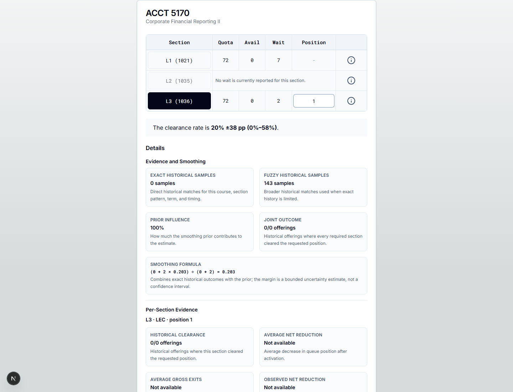
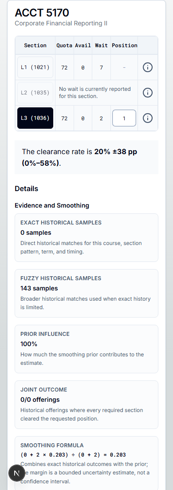
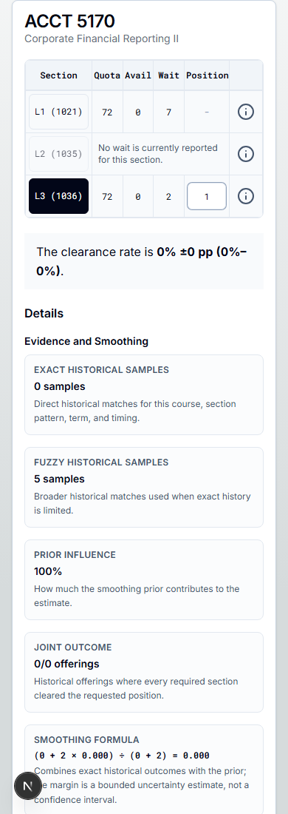
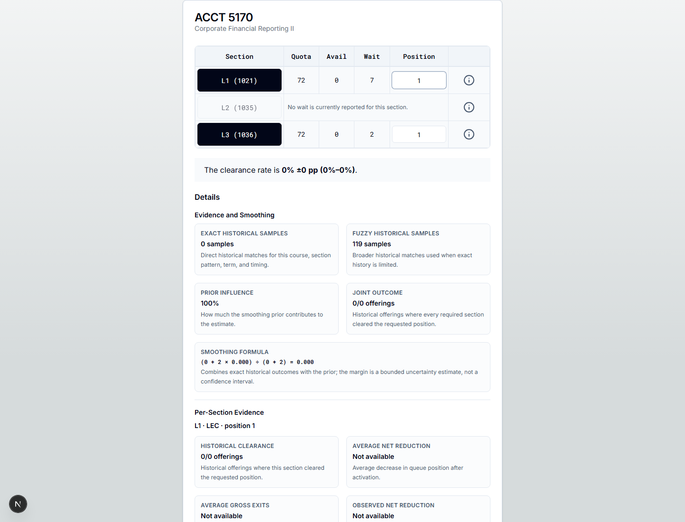
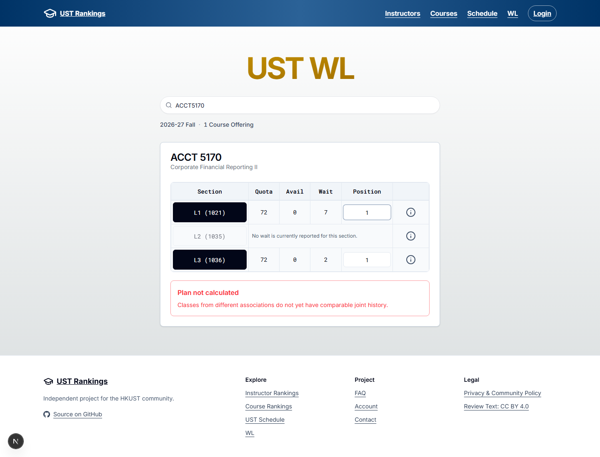
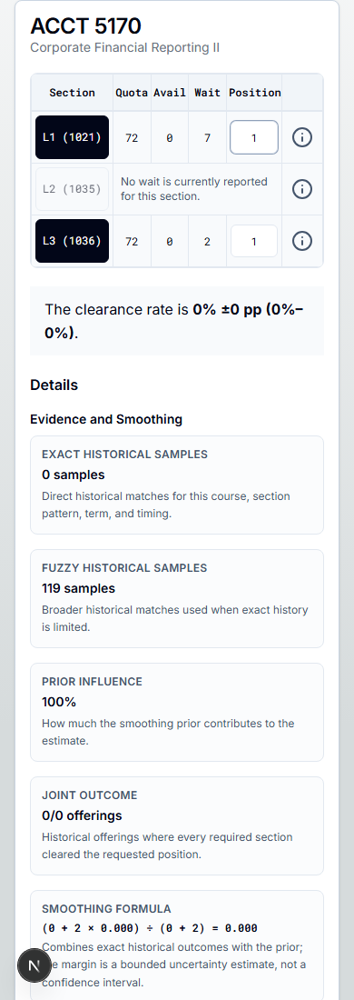
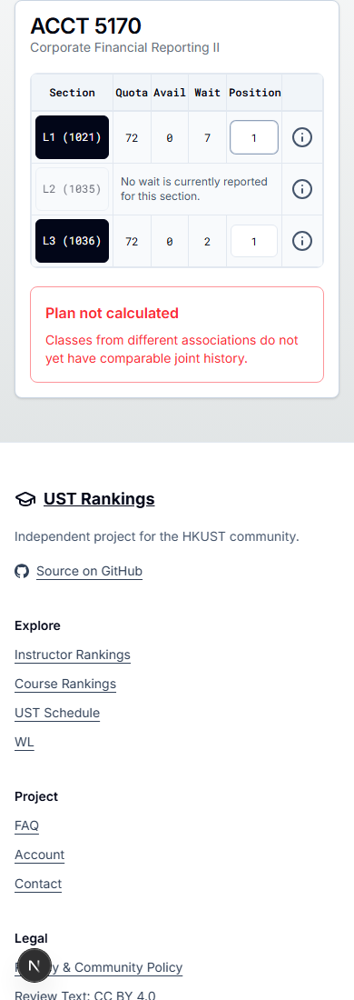
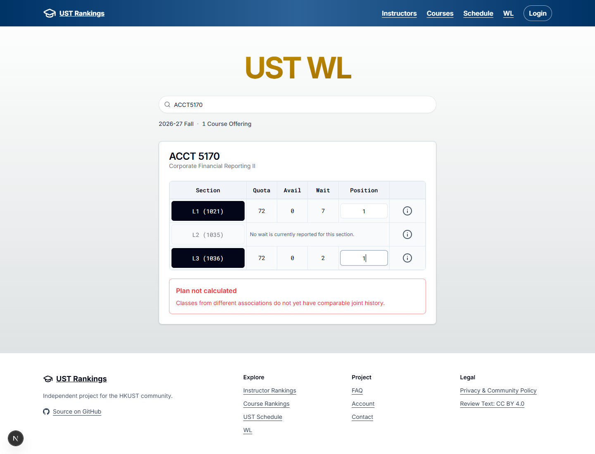
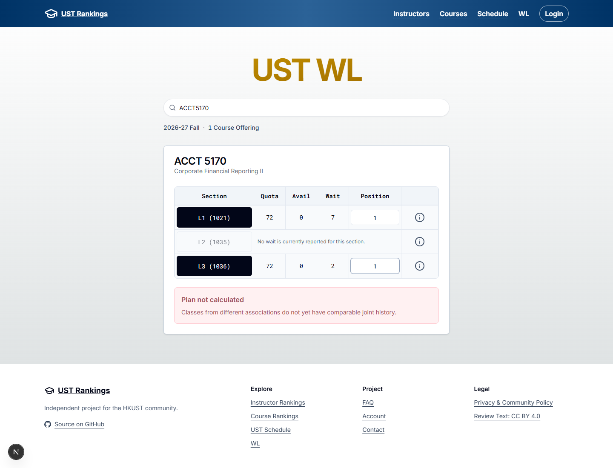
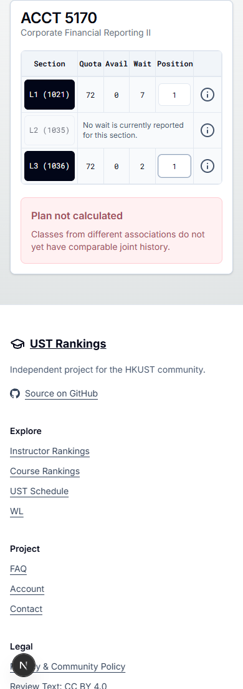

# PR #197: Waitlist association grain

**Estimate behavior remains unapproved pending a reference-first redesign.** The draft aligns current component ordinals with historical association-level bundles and refuses mixed-association Plans. The user wants estimates to remain useful rough references for students and finds this proposal too restrictive. The separately authorized warning-color refinement below changes presentation only. Model weights and the current draft's mixed-Plan behavior are unchanged; selected evidence can still change materially.

## Actual matching impact

Real ACCT 5170 in Term 2610 has L1, L2 and L3 in associations 1, 2 and 3. With L3 at position 1:

| Field | Current master before | Proposed after |
| --- | --- | --- |
| L3 LEC ordinal | 2 across the Course Offering | 0 within association 3 |
| Displayed estimate | 20% ±38 pp (0%–58%) | 0% ±0 pp (0%–0%) |
| Exact / broader samples | 0 / 143 | 0 / 5 |
| Prior influence | 100% | 100% |
| Joint outcome | 0/0 offerings | 0/0 offerings |

This is a **matching-choice impact, not an established statistical accuracy gain**. The inherited sparse-prior formula exposes a zero-width margin despite zero exact samples and five broader samples. That apparent confidence remains unvalidated. Approve or revise the sample grain, uncertainty treatment and model/Delivery version policy before release; this patch does not introduce a new statistical policy.

| Before L3 position 1 | Proposed after, same position |
| --- | --- |
|  |  |
|  |  |

## Mixed-association Plan

Selecting L1 and L3 at position 1 currently computes 0% ±0 pp using 119 broader samples, with zero exact samples. The draft keeps both selected queues but returns **Plan not calculated** with “Classes from different associations do not yet have comparable joint history.”

| Before, L1 + L3 | Proposed unsupported result |
| --- | --- |
|  |  |
|  |  |

## Decision and implementation

The next design should preserve genuine association-matching corrections without unnecessarily removing useful references. Explore showing separate rough references for each association in a mixed Plan, retain the existing broader-history fallback when exact evidence is absent, and qualify sparse or entirely prior-based evidence. Separate references would not establish a joint probability. This direction needs review before implementation; this amendment does not change the predictor, uncertainty formula or mixed-Plan policy.

Whole-Course-Offering regrouping is another possible design, not a prerequisite imposed by this review. It would need cross-Term structural association matching and joint sample counting; numeric association IDs are not stable cross-Term identities. Existing association-level history may count multiple associations from one Course Offering, so independence and uncertainty remain unresolved.

[Matching demo](matching-demo.json) records the actual current Class associations and the shared function's candidate result. [Current Classes](current-classes.json) also records the real LANG 1402 shape: 60 TUT Classes in 60 associations, all with no reported current wait. It demonstrates why later TUTs map to local ordinal 0; no live prediction is claimed for those zero queues. [Full design](../../research/waitlist-association-grain.md) describes retained matching semantics and alternatives.

## Authorized warning-color refinement

The user requested a lighter, less saturated red for **Plan not calculated**. This alert now uses muted rose text (`#9f4f5c`), a pale pink surface (`#fff1f2`) and a light rose border. Measured body-text contrast is **5.10:1**. The change is local to this alert; its message, dimensions, selected queues and calculation behavior are unchanged.

| Before color | After color |
| --- | --- |
|  |  |
|  |  |

Both pairs show the same real ACCT 5170 mixed Plan, L1 and L3 at position 1, at matching framing. The mobile alert remains 324 × 106 px and the page has no horizontal overflow. The color-before application is PR head `7f8e8182e21d6267584b05ad8b3edb20d9cce4a3`; the only subsequent application change is this local style. These images do not imply approval of the unsupported-Plan behavior.

## Evidence and verification

Before application baseline: `fb8d3667e0fa503fbb499280dff28eef563cd5a6`; final master: `6600134bcc008b260803c4bbce93964b15351b5c`. The intervening #179 changes analysis and #211 changes only two workflow files; neither affects the captured UI. The after proposal is rebased on final master. The single-section estimate pair uses matching top-of-card framing. Mixed-Plan captures show the computed versus unsupported result; the shorter unsupported desktop card also reveals the page header. All captures were inspected at 1440px and 390px.

Real immutable pins: ranking `ce581438297e78fdccf1f20cf279f8e5f7cfdcbc`, Schedule `f9632eceb9751da775079efb472c6ba80d03be11`, Delivery `ceb4b57f66314feeaf94f48a40467d01fd057cbfbbe3d818744d946e3b5fbda8`. The unified Schedule and actual browser DuckDB Worker provide the estimates; no public preview fixtures, published-statistics refresh or provider mutation occurred.

Focused evidence/runtime regressions pass (18 tests across two files), including later association ordinals, cross-Term differing IDs, same-association AND outcomes and mixed-Plan rejection. The color amendment adds no behavior or mirrored tests. Its application TypeScript and Biome checks pass; the required manual UI detector ran once after the final UI change and returned no findings (`[]`). Full prior checks and current-head CI are recorded in the PR body.
