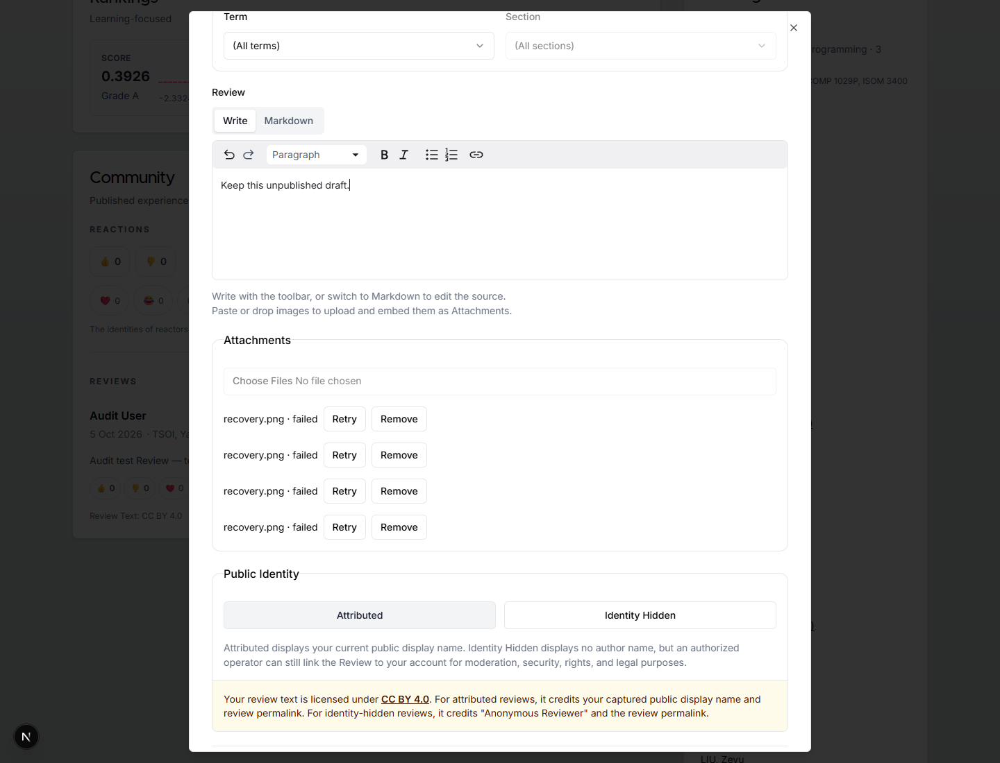
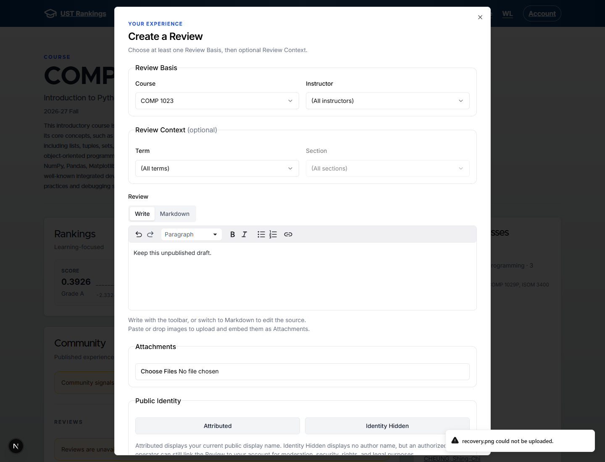
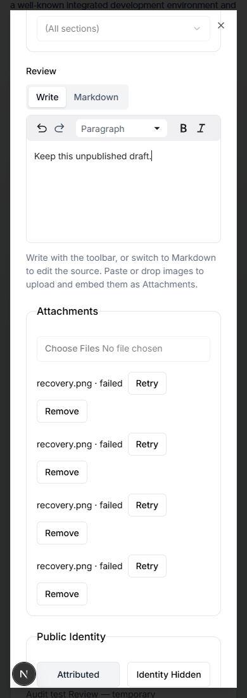
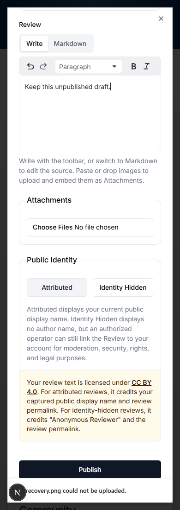

# PR #205: Failed uploads notify and leave the list

Failed uploads used to stay in the Review composer's four-slot attachment list. Repeated failures could disable Add without attaching any file. The requested behavior now shows an existing Sonner warning toast reading `<filename> could not be uploaded.` and removes the failed entry, so the user can choose a file again while keeping their text and successful attachments.

## Before and after

The before captures show the previous #205 proposal at `9bac6f5fe7293563db6e6c684c73091655548daf`: four failed `recovery.png` entries, disabled Add, and proposed Retry/Remove controls. The after captures show the requested simpler flow: a failure toast, no failed rows or recovery controls, and Add enabled. Both use the same unpublished text and real Course COMP 1023, on master base `6600134bcc008b260803c4bbce93964b15351b5c`.

The refreshed branch includes master `3d8168acbb411bc0b702b327118e72c623dca0d6`. That base update changes search and pagination; the captured composer implementation remains unchanged.

| Before | Requested after |
| --- | --- |
|  |  |
|  |  |

## Implementation and impact

- The shared reservation/transfer/completion error handler removes only the failed draft ID and shows its filename in the existing toast mechanism. Draft state contains only pending and ready entries; it no longer retains a local File for Retry.
- Pending and successful attachments retain their existing behavior. Only ready attachments enter the submission payload. The proposed Retry and Remove controls are deleted, so a successful inline attachment cannot be removed through a new control.
- Markdown and successful attachment IDs are preserved, including after cancel/reopen. A manually typed reference to an upload that later fails is left in the text; existing server validation still requires every inline reference to have an attached ready file.
- Server upload completion, expiration, ownership and orphan policies are unchanged. This does not implement #201 or #204.

## Evidence and verification

The fresh 1440px and 390px captures were inspected. They use the real local API with `ATTACHMENTS_UPLOADS_DISABLED=1`, a disposable local authenticated User, and the preserved local PostgreSQL cluster. No external object upload or Review submission occurred.

Public read-only inputs remain immutable: ranking `ce581438297e78fdccf1f20cf279f8e5f7cfdcbc`, Schedule `f9632eceb9751da775079efb472c6ba80d03be11`, Delivery `ceb4b57f66314feeaf94f48a40467d01fd057cbfbbe3d818744d946e3b5fbda8`. The unified Schedule and MAIN's existing Delivery bytes were used; no public data fixture was regenerated or substituted.

The existing authenticated browser regression failed on the old draft's missing toast, then passed locally (1/1). It exercises four actual local 503 reservation failures, released slots, text retained after cancel/reopen, a held pending transfer that becomes ready, and local transfer/completion failures while retaining a successful inline attachment and the exact Markdown. The latter states use explicitly labeled browser wire seams for storage responses; they are not provider storage verification. Ordinary CI skips this token-gated authenticated case; the local run supplies its evidence.

Before the warning/text refinement, `npm run check` passed: toolchain and Biome checks, application/data TypeScript, 187 application tests and 38 data tests. The refinement reruns the existing authenticated browser regression (1/1), application TypeScript, Biome, and diff checks. The required UI detector ran once after the final UI change and returned zero findings. The named browser, isolated Next and Delivery previews, and owned local PostgreSQL cluster were stopped after capture; temporary preview configuration was restored.
