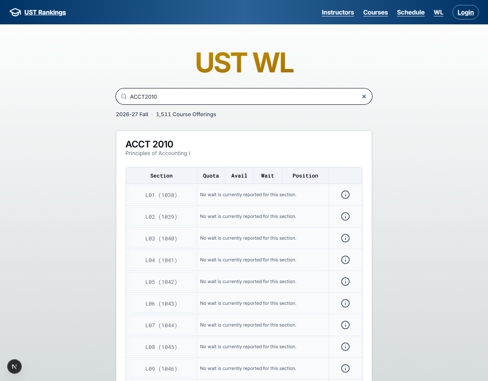
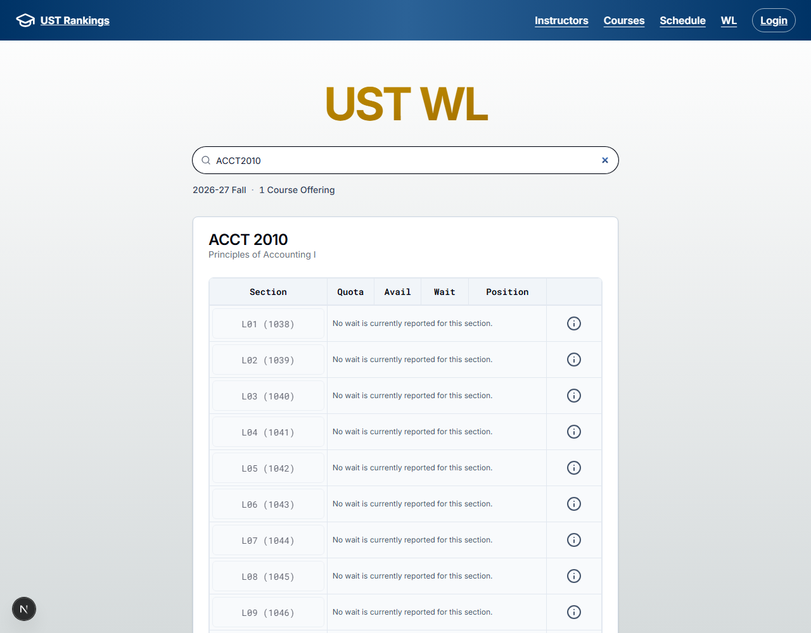
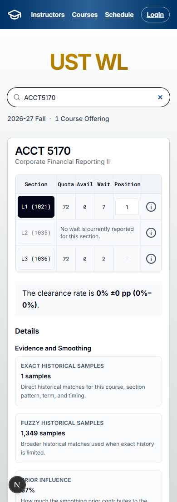

# PR #208: Search navigation readiness

**Held for navigation cost and recovery review.** The shared search control proposes `router.replace` for Course/Instructor rankings, Schedule and WL. This bypasses the early native-history integration window, but changes server navigation cost and pending-navigation behavior.

## Real-data controlled comparison

Both contexts deliberately withhold Next's native-history adapter while preserving its original native writes. Search is typed before waiting for initial cards. The actual browser DuckDB Worker and immutable real Delivery remain active; results are not mocked. This extended timing seam demonstrates the failure boundary, not its frequency in production.

| Evidence | Current master before | Proposed after |
| --- | --- | --- |
| URL and input | `q=ACCT2010` / `ACCT2010` | `q=ACCT2010` / `ACCT2010` |
| Visible card count | 24 unfiltered cards | 1 matching card |
| Displayed total | 1,511 Course Offerings | 1 Course Offering |
| Worker request | Unfiltered `waitlistSearch` only | Also sends `search: ACCT2010` |
| RSC navigation requests for this search | 0 | 1 |

| Before | Proposed after |
| --- | --- |
|  |  |

The first visible Course happens to match the search in the unfiltered result, so the total and [before Worker trace](before-readiness.json) distinguish the error. The [after trace](after-readiness.json) records the filtered request and extra RSC navigation.

## Ordinary Back/Forward and mounted Plan demo

A separate context uses normal history integration with no seam. It visits `LANG1402`, then `ACCT2010`; typing `ACCT5170` replaces the second entry without growing history (length remains 3). Back restores `LANG1402` input/cards; Forward restores `ACCT5170`. A selected L1 position 1 survives filtering away to `ACCT2010` and returning on the same mounted WL page. This does not claim Plan persistence across page unmounts or reloads.

[History states](history-demo.json) record the actual URLs, input values and card labels. A compact prefix can match multiple codes: `LANG1402` correctly returns both LANG 1402 and LANG 1402I.

## Decision and implementation

- Accept an RSC navigation request for each search change on all four surfaces, or retain native history with a reliable readiness gate and early-input replay policy. This draft adds no debounce or cache-policy change; production typing latency/cost are not established by the local trace.
- Router replacement is asynchronous. A synchronous client search-intent revision invalidates old pagination before its destination URL commits; the existing mounted-lifetime and committed-URL guards remain.
- Decide recovery for failed/canceled navigation or a return to the same query before an intermediate navigation commits. Old pagination remains invalidated; reload currently re-establishes it. This limitation is deliberate and unresolved.
- Master already contains #193's ordinary pending state outside a React transition, lifecycle/URL guards and unchanged held-Worker tests. This draft adds no duplicate pagination pending-state mechanism or Worker cancellation policy.

[Full design and regression boundary](../../research/search-navigation-readiness.md) records the original natural timing observation and held-Worker/held-RSC coordination evidence. The current before/after pair is controlled and must not be interpreted as a production prevalence measurement.

## Evidence and verification

Before UI baseline `fb8d3667e0fa503fbb499280dff28eef563cd5a6`; final master `6600134bcc008b260803c4bbce93964b15351b5c`. The intervening #179 changes analysis and #211 changes only two workflow files; neither affects the captured UI. After is rebased on final master, with Next 16.3.8. The three captures were inspected at 1280px and 390px; mobile has no horizontal overflow.

Real immutable pins: ranking `ce581438297e78fdccf1f20cf279f8e5f7cfdcbc`, Schedule `f9632eceb9751da775079efb472c6ba80d03be11`, Delivery `ceb4b57f66314feeaf94f48a40467d01fd057cbfbbe3d818744d946e3b5fbda8`. Unified Schedule and read-only public data were used; no public-preview fixtures, real OAuth or production/provider writes.

The real-data controlled before/after assertions and normal Back/Forward/Plan-retention assertions pass. Existing browser regressions cover early search, preserved filters, held old pagination, held RSC search and mounted Plan filtering. Full checks/current-head CI are recorded in the PR body.
